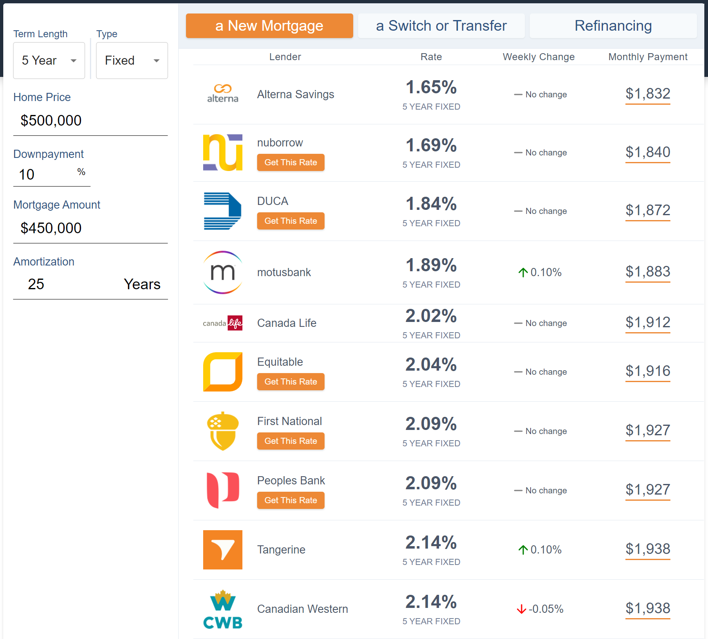
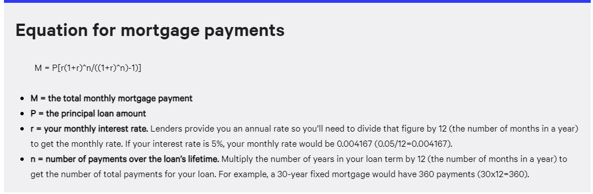

# WOWA Challenge

The goal of this project is to introduce you to our tech stack. Our frontend uses React with Redux and TailwindCSS. Our backend uses Django with Django Rest Framework (DRF) and PostgreSQL.

## Task: Create a mortgage rates table and simple calculator

You will need to create and design a full-stack application that shows Canada mortgage rates and allows you to calculate your mortgage payments, essentially recreating the bottom of https://wowa.ca/mortgage-rates-ontario



## Objectives

- Frontend must be coded using Typescript

- You should have a table of mortgage rates with the following columns: Lender, Rate, Monthly Payment. You will not add "Weekly Change"

- You should have a mortgage calculator with options to change term length and type based on the data available. The results shown in the rates table should reflect the current selected term length and type. The results in the column of Monthly Payment should reflect the parameters entered.

- You are _highly encouraged_ to use TailwindCSS classes

- You do not have to implement the "I am looking to get rates for..." part of the table

- You do not have to implement "Get This Rate"

- Your design should be responsive, but the implementation is up to you. You can show different components for different breakpoints, but the overall design should stay consistent across screen widths.

- In any one view, you should show only the lowest rate for a certain lender with the chosen `year` and `rate_type`. This means you will have to filter and select through the rates.

- The rate table should be **sorted** from lowest to highest interest rate.

- You should include the logos of each lender

### Bonus Objectives

- Utilize [`getStaticProps`](https://nextjs.org/docs/basic-features/data-fetching#getstaticprops-static-generation) to inject the mortgage rates data during build-time. Should be revalidated every day.

## Frontend

I have provided a base Next.JS setup with the following features:

- Prettier + ESLint code formatting

- Integrated Typescript

- Integrated TailwindCSS

You should extend it, putting your pages in `/pages` and other components in `/src`.

The data model for mortgage rates is as follows (in TypeScript notation):

```
MortgageRate:
  source: string (the lender)
  year: number (length of mortgage term in years)
  down_payment_level: number (will not be used)
  first_mortgage: boolean (will not be used)
  long_amortization: boolean (will not be used)
  rate_type: string (fixed or variable)
  rate: number
  posted: boolean (will not be used)
  refinance_rate: number (will not be used)
```

## Backend

You should use a backend to deliver the mortgage rate data. You are free to choose your own preferred implementation of backend framework (e.g. Flask, Django, Express), API schema (REST, GraphQL), and database (e.g. PostgreSQL, MySQL, MongoDB, SQLite)

## Data

I have provided some data at [data/rates.json](data/rates.json). It follows the above format.

As for the logos, I have included some in `/data/logos`. Feel free to take them from our website (right-click and `Save image`).

## Information About Mortgages

Mortgages come in two types: Fixed-rate and Variable-rate. Short form: Fixed and Variable.

Mortgage terms represent the number of years a single mortgage contract is signed for and is usually 5 years, but can range between 1 to 10 years.

Each year and type have their own set of rates.

Mortgage amortization represents the number of years it will take to pay off the mortgage if you make just the regular payments. Amortizations in Canada can range from 20 to 30 years, with 25 years being the most common.

Down payment is the amount that you put up for a home. You can use the default given.

Payment frequency can be monthly or bi-weekly. For this assignment, you can assume monthly.

**Math Reference**

Home Price = Down Payment + Mortgage Amount

**Monthly Payment Calculation**

Available at https://www.bankrate.com/calculators/mortgages/mortgage-calculator.aspx and https://www.thebalance.com/calculate-mortgage-315668

**Other Notes**

- Please use Yarn v1

## Helpful Links

React: https://reactjs.org/

Next.JS: https://nextjs.org/

TailwindCSS: https://tailwindcss.com/

Material-UI: https://material-ui.com/

TypeScript: https://www.typescriptlang.org/

styled-jsx: https://github.com/vercel/styled-jsx
